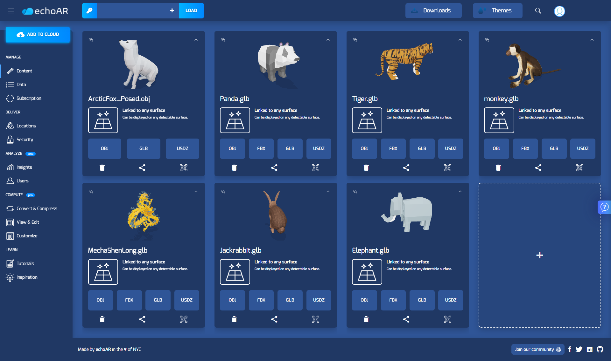
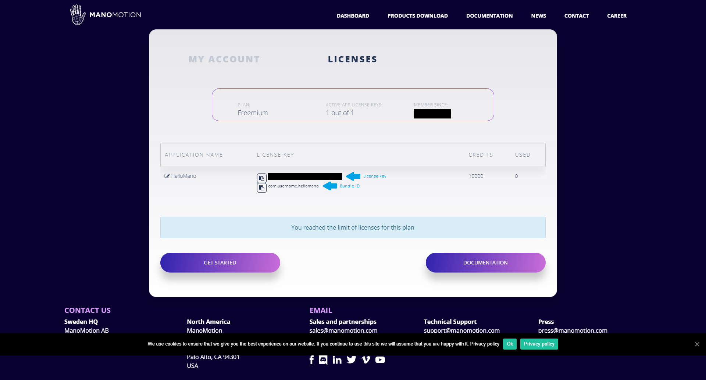

# Unity-ManoMotion-echoAR-demo-Hand-Tracking
 
This Unity demo uses echoAR's 3D model streaming in combination with [ManoMotion](https://www.manomotion.com/), a framework for hand-tracking and gesture recognition in AR. Any number of models can be uploaded to the echoAR console and streamed into the app. You can tap on any detected horizontal plane to move the active model to that location, and use the button at the top of the screen to switch to the next model. The button can be tapped on via the screen, but it can also be used by placing your hand in front of the camera and making a "click" gesture behind the button, as shown below.

## Register
* Make sure to register for FREE at [echoAR](https://console.echoar.xyz/#/auth/register) to get an echoAR API key.
* Register for FREE at [ManoMotion](https://www.manomotion.com/registration/?gf_plan=ce) to get a ManoMotion license key.

## Setup
* Clone this project and open it in Unity 2020.1.2 (or newer).
* Open the scene under _Scenes/Main_.
* Set your echoAR API key in (1) the echoAR prefab uner _Assets/echoAR/_, (2) the echoAR game object , (3) the Place on Plane script in the AR Session Origin game object in the hierarchy throguh the inspector.
* Upload the contents of the [models folder](/models/) through the [echoAR console](https://console.echoar.xyz).
* Upload the metadata in the [metadata folder](/metadata/) for each model in the Data tab of the [echoAR console](https://console.echoar.xyz).
* Go to your [ManoMoation account](https://www.manomotion.com/my-account/licenses/) and copy your ManoMotion license key (e.g., ABCD-ABCD-ABCD-ABCD) into the ManomationManager gameobject.
* Go to your [ManoMoation account](https://www.manomotion.com/my-account/licenses/) and copy your Bundle ID (e.g., com.username.hellomano). In Unity, click _File > Build Settings > Player Settings... > Player > Android_ and set the Bundle ID as under _Identification > Package Name_.

You can also add your own models to the echoAR console by searching or adding your own, and they will appear when you cycle through the models. Just make sure that the number of models does not exceed the value you give to the maxModels variable of the Place on Plane script of the AR Session Origin.

## Run
[Build and run the AR application](https://docs.echoar.xyz/unity/adding-ar-capabilities#4-build-and-run-the-ar-application).

Make sure to pick the _Scenes/Main_ scene under _Scenes In Build_.

## Learn more
Refer to our [documentation](https://docs.echoar.xyz/unity/) to learn more about how to use Unity and echoAR.

Checkout the [ManoMotion SDK Community Edition Tutorial for ARFoundation](https://www.youtube.com/watch?v=OVkSjTefLo8&ab_channel=ManoMotion).

If you want more demos of Manomotion's technology, there are additional demos created by Manomotion in the Manomotion/Examples folder. Although these do not incorporate echoAR, they show off a lot more functionality. Please see [ManoMotion's website](https://www.manomotion.com/) to see documentation and to get your own API key.

## Support
Feel free to reach out at [support@echoAR.xyz](mailto:support@echoAR.xyz) or join our [support channel on Slack](https://join.slack.com/t/echoar/shared_invite/enQtNTg4NjI5NjM3OTc1LWU1M2M2MTNlNTM3NGY1YTUxYmY3ZDNjNTc3YjA5M2QyNGZiOTgzMjVmZWZmZmFjNGJjYTcxZjhhNzk3YjNhNjE).

## Screenshots

Demo created by [Caleb Biddulph](https://github.com/CDBiddulph/).
